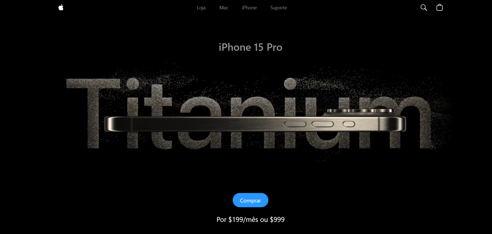

# 🍏 Apple Website Clone 

Clone front-end do site da Apple, focado no iPhone 15 Pro. Desenvolvido com **React**, **Vite**, **TailwindCSS**, **GSAP** e **Three.js**, estre projeto visa replicar a estética e interatividade do site oficial da Apple, utilizando animações suaves e modelos 3D interativos.

---

## Preview 🖼️



---

## Acesse Online 🔗

[apple-website-two-roan.vercel.app](https://apple-website-jg11.vercel.app)

---

## Tecnologias Usadas 🛠

- **React** – Biblioteca JavaScript para construção da interface de usuário.
- **Vite** – Ferramenta de build e desenvolvimento rápido.
- **TailwindCSS** – Framework CSS utilitário para estilização.
- **GSAP** – Biblioteca para animações de alto desempenho.
- **Three.js** – Biblioteca JavaScript para renderização 3D.

---

## 🚀 Como Rodar Localmente

```bash
# Clone o repositório
git clone https://github.com/nandosabino/apple-website.git

# Navegue até o diretório do projeto
cd apple-website

# Instale as dependências
npm install

```

Acesse o projeto em http://localhost:5173

# Inicie o servidor de desenvolvimento
npm run dev
